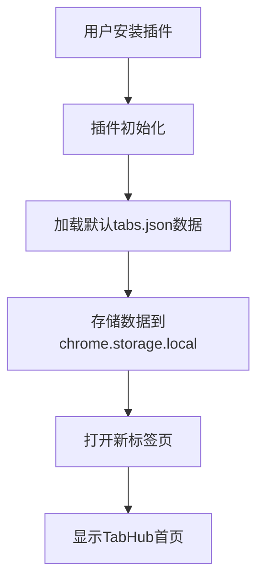
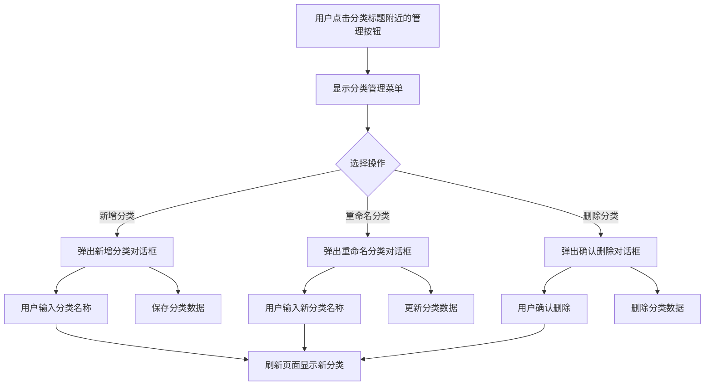

# TabHome 大宝标签管理器 - 产品设计文档

## 1. 产品结构图

```
TabHome 大宝标签管理器
├── 新标签页 (index.html)
│   ├── 顶部导航栏
│   │   ├── 插件标题 "TabHome"
│   │   └── 搜索框
│   ├── 主体内容区
│   │   ├── 分类1
│   │   │   ├── 分类标题
│   │   │   ├── 标签卡片1
│   │   │   ├── 标签卡片2
│   │   │   └── ...
│   │   ├── 分类2
│   │   │   ├── 分类标题
│   │   │   ├── 标签卡片1
│   │   │   ├── 标签卡片2
│   │   │   └── ...
│   │   └── ...
│   └── 底部操作栏
│       ├── 添加标签按钮
│       ├── 导入JSON按钮
│       ├── 导出JSON按钮
│       └── 设置按钮
├── 标签管理
│   ├── 添加标签
│   ├── 编辑标签
│   ├── 删除标签
│   └── 标签详情
├── 分类管理
│   ├── 新增分类
│   ├── 重命名分类
│   └── 删除分类
└── 数据管理
    ├── 导入JSON
    └── 导出JSON
```

## 2. 用户流程图

### 2.1 首次安装流程



### 2.2 添加标签流程

```mermaid
flowchart TD
    A[用户点击"添加标签"按钮] --> B[弹出添加标签对话框]
    B --> C[用户填写标签信息]
    C --> D[用户选择分类]
    D --> E[用户点击"保存"按钮]
    E --> F[验证输入信息]
    F --> G[存储标签数据]
    G --> H[刷新页面显示新标签]
```

### 2.3 编辑标签流程

```mermaid
flowchart TD
    A[用户鼠标悬停标签卡片] --> B[显示编辑/删除按钮]
    B --> C[用户点击"编辑"按钮]
    C --> D[弹出编辑标签对话框]
    D --> E[用户修改标签信息]
    E --> F[用户点击"保存"按钮]
    F --> G[验证输入信息]
    G --> H[更新标签数据]
    H --> I[刷新页面显示更新后的标签]
```

### 2.4 删除标签流程

```mermaid
flowchart TD
    A[用户鼠标悬停标签卡片] --> B[显示编辑/删除按钮]
    B --> C[用户点击"删除"按钮]
    C --> D[弹出确认删除对话框]
    D --> E[用户确认删除]
    E --> F[删除标签数据]
    F --> G[刷新页面显示更新后的标签列表]
```

### 2.5 管理分类流程



### 2.6 导入/导出数据流程

#### 2.6.1 导出数据

```mermaid
flowchart TD
    A[用户点击"导出JSON"按钮] --> B[读取chrome.storage.local中的数据]
    B --> C[生成tabs.json文件]
    C --> D[触发文件下载]
```

#### 2.6.2 导入数据

```mermaid
flowchart TD
    A[用户点击"导入JSON"按钮] --> B[弹出文件选择对话框]
    B --> C[用户选择tabs.json文件]
    C --> D[读取文件内容]
    D --> E[验证JSON格式]
    E --> F[存储数据到chrome.storage.local]
    F --> G[刷新页面显示导入的数据]
```